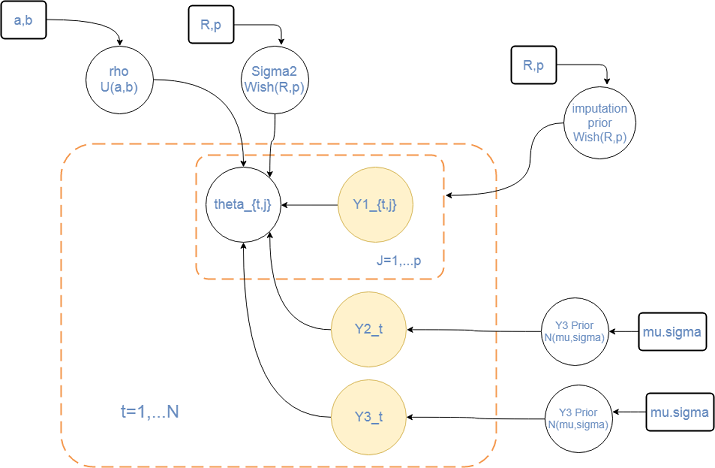
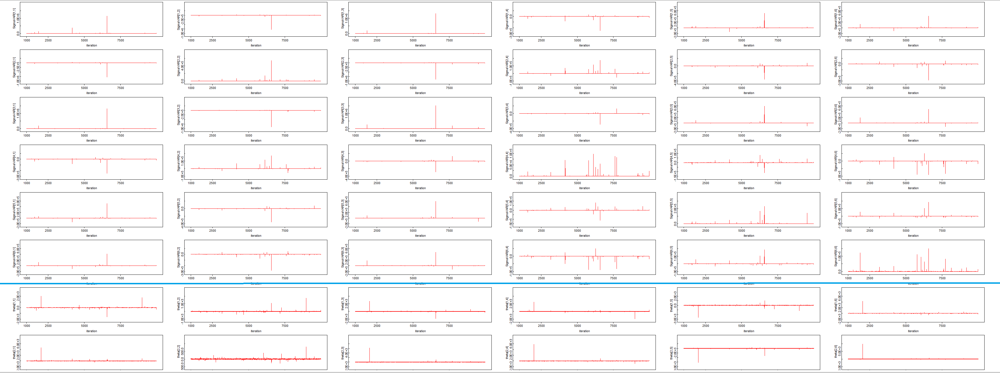

---
```{r setup, include=FALSE,echo=FALSE}
rm(list = ls())
setwd("d:/brucebcampbell-git/bayesian-learning-with-R/SCALED/report")
knitr::opts_chunk$set(echo = TRUE)
knitr::opts_chunk$set(dev = 'pdf')
knitr::opts_chunk$set(cache=TRUE)
knitr::opts_chunk$set(tidy=TRUE)
knitr::opts_chunk$set(prompt=FALSE)
knitr::opts_chunk$set(fig.height=4)
knitr::opts_chunk$set(fig.width=6.5)
knitr::opts_chunk$set(warning=FALSE)
knitr::opts_chunk$set(message=FALSE)
knitr::opts_knit$set(root.dir = ".")
knitr::opts_chunk$set(tidy.opts=list(width.cutoff=38),tidy=TRUE)
library(latex2exp)   
library(pander)
library(ggplot2)
library(GGally)
```

#Statistical Model

We fit a vector autoregressive  model - $VAR(1) \in \mathbf{R}^6$ given by 

$$\theta_{t} = \nu + \rho * \theta_{t-1} + \epsilon$$ 

$$\epsilon \sim N(0,\Sigma)$$  Models of higher order are also resonable for the type of data we were give, indeed an ACF plot of $Y3$ row indicates that this might be a useful follow up activity.  

The model is fit in 2 stages.  The first stage imputes missing values in Y1 and estimate the theta variables from Y1.imputed,Y2,Y3. The other to fit the parameters of the vector autoregression.  We wanted to fit this all in OpenBugs, but the VAR(1) component introduced convergence issues into our MCMC chains. JAGS does not allow missing data in a multivariate node.

Below is a plate diagram of the entire model



We computed a pairwise complete covariance matrix for $Y1$, this confirmed that there are dependencies from $\Sigma_1,\Sigma_2$ that require a multivariate approach. A nearest PSD matrix was calculated and this was used to generate a VAR(1) test data set for model development. The test workflow, data visualizations and images of the MCMC artifacts are in the located in the folder Midterm2 on github in

```https://github.com/brucebcampbell/bayesian-learning-with-R.git```

For all of the estimates in our analysis we used a MAP estimate from the posterior samples. The R package ```mlv`` provides an implementation of the  Venter mode estimator (also called the Dalenius, or LMS (Least Median Square) mode estimator).

\newpage

#OpenBugs  model

```{r}
openbugs_model <- function(){

  #VAR(1) parameters <----- DONE IN JAGS BELOW off of the theta MAP estimates- WE COULD NOT PORT IT TO OPENBUGS :(
  # for(i in 2:N) {
  #   Y1pred[i,1:p] ~ dmnorm( nu[i,1:p] ,precisionVar[,])
  #   nu[i,1:p]<-  mu2[1:p] + rhoXtheta[1:p,1:p]    
  #   for ( k in 1: p ){
  #     for ( l in 1: p){
  #       rhoXtheta[k , l ] <- inprod(rho[k , 1: p ] , theta[l, 1: p ])
  #     }
  #   }
  # }
  # 
  # for(i in 1:p) {
  #   mu2[i] ~ dnorm(0, 0.01)
  #   rho[i,i] ~ dunif(-1, 1)
  #   for(j in (i+1):p) {
  #     rho[i,j] ~ dunif(-1,1)
  #     rho[j,i] ~ dunif(-1,1)
  #   }
  # }
  # 
  # precisionVar[1:p,1:p] ~ dwish(I[,],p+1)
  # SigmaVAR[1:p,1:p] <- inverse(precisionVar[,])
  
  #theta
  for(i in 1:N) {
    
    Y2[i] ~ dnorm(theta[i,1], inv.var)
    
    Y3[i] ~ dnorm(thetaBar[i] , inv.var)
    thetaBar[i] <- 1/6 *(theta[i,1]+theta[i,2]+theta[i,3]+theta[i,4]+theta[i,5]+theta[i,6])
  }
    
  inv.var   ~ dgamma(.5, 1.3)
  
  for(i in 1:N){
    for(j in 1:p){
      theta[i,j] ~ dnorm(Y1[i,1],inv.var)
      
    }
  }
  
  # Missing data model for x
  for(i in 1:N){
    Y1[i,1:p]~dmnorm(Y1_mn[],Y1_prec[,])
  }
  
  # Priors for missing-data model parameters
  for(j in 1:p){
    Y1_mn[j]~dnorm(0,0.01)
  }
  Y1_prec[1:p,1:p]~dwish(R[,],k)
  Y1_cov[1:p,1:p]<-inverse(Y1_prec[,])
  
  k<-p+0.1
  for(j1 in 1:p){for(j2 in 1:p){R[j1,j2]<-0.1*equals(j1,j2)}} #R is diagonal
}
```

\newpage

##Diagnostics for OpenBugs chains

The Gelman-Rubin convergence diagnostic is computed for each $\hat{\theta}_{ij}$.  2 chains were run for a total of 20,000 iterations with a burnin of 5000. Thinning every at 2'nd sample is performed to reduce autocroeelation in the chain. 

The Gelman-Rubin diagnostic analyzes multiple chains of the same node in our model and compares the within chain variance to the between chain variance.  It's a rule of thumb that chains with a Gelman-Rubin statistic below 1.1 have convereged well.  In the plot below we see that most of the chains have converged well.   


The effective samples size for all of the theta chains is plot below.


The figure below is an example MAP Ventner estimator of the mode for $\hat{\theta}_{1 3}$. 


\newpage 

### Performance evaluation

We compare the performance of the MAP estimates $\hat{\theta}_{ij}$ against the values in Y1. 

This is an image plot of $\hat{\theta}_{i j}$.  


The structure is simiar to Y1, when we box plotted $\hat{\theta}_{i j}$ and compared to $Y1$ we noted that the level of $Y1[,6]$ seemed surpressed. We looked into whether this was from inputation, or the effect of including $Y3$, but were unable to make a determination as to why this was the case.    


A look at the plot of the rowmeans of theta indicates that the autoregressive structure is similar to what we observed in the plot of $Y3$.   

\newpage 

###JAGS - Model and Diagnostics section for VAR(1) parameters

```{r}

# Jags code to fit the model to the simulated data
model_code = '
model
{
  for(i in 2:N) {
    Y1pred[i,1:p] ~ dmnorm( nu[i,1:p] ,precisionVar[,])
    nu[i,1:p]<-  mu2[1:p] + rho %*%  theta[i-1,]
    }
  
  for(i in 1:p) {
    mu2[i] ~ dnorm(0, 0.01)
    rho[i,i] ~ dunif(-1, 1)
    for(j in (i+1):p) {
      rho[i,j] ~ dunif(-1,1)
      rho[j,i] ~ dunif(-1,1)
    }
  }
  
  precisionVar[1:p,1:p] ~ dwish(I,p+1)
  SigmaVAR ~ dwish(I, p+1)
  
}
'
```


```{r,echo=FALSE}
v1 =c("5.45","0.1455","0.002842","0.09453","-0.06835","-0.007547")
v2 =c("0.1455","5.49","-0.04213","0.06303","-0.06088","-0.0287712")
v3 =c("0.002842","-0.04213","5.575","-0.01946","-0.02473","0.03387")
v4 =c("0.09453","0.06303","-0.01946","5.393","0.02807","-0.0182")
v5 =c("-0.06835","-0.06088","-0.02473","0.02807","5.512","-0.03613")
v6 =c("-0.007547","-0.02877","0.03387","-0.0182","-0.03613","5.378")
df<- rbind(v1,v2,v3,v4,v5,v6)
colnames(df)<-NULL
row.names(df)<-NULL
pander(df,caption="MAP estimate of Sigma")
```

\newpage 

Bleow are plots for the Gelman-Rubin diagnostic and ESS for the MCMC chains for $Sigma$ in the VAR(1) process. 


The effective samples size for all of the theta chains is plot below.


We include one last plot detailing the issue that prevented us form fitting the full VAR(1) model in OpenBugs. The chains for the Sigma parameter experienced instability that stringly biased the poeteriors for the thetas. 


