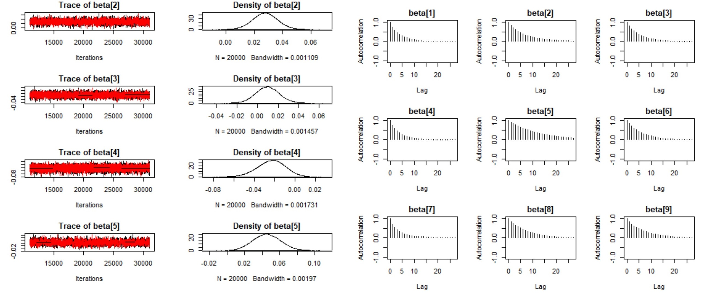
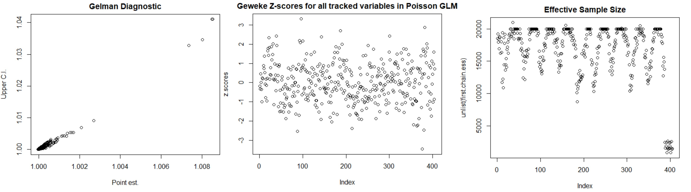

```{r setup, include=FALSE,echo=FALSE}
rm(list = ls())
knitr::opts_chunk$set(echo = TRUE)
knitr::opts_chunk$set(dev = 'pdf')
knitr::opts_chunk$set(cache=TRUE)
knitr::opts_chunk$set(tidy=TRUE)
knitr::opts_chunk$set(prompt=FALSE)
knitr::opts_chunk$set(fig.height=5)
knitr::opts_chunk$set(fig.width=6)
knitr::opts_chunk$set(warning=FALSE)
knitr::opts_chunk$set(message=FALSE)
knitr::opts_knit$set(root.dir = ".")
knitr::opts_chunk$set(tidy.opts=list(width.cutoff=38),tidy=TRUE)
library(latex2exp)   
library(pander)
library(ggplot2)
library(GGally)
```
\newpage 

#Model Definitions
In this report we detail a Bayesian analysis of temperature data to test if the distribution of heatwaves in the American Southwest has temporal dependence. We investigated a number of heat wave indices and found 2 common ones used in climate studies.  The World Meteorological Organization (WMO) is specific in its definition by stating that a heat wave is when the daily temperature for more than five consecutive days exceeds the average temperature by 9 degrees F.  There are other definitions used in climate research -  for example the TX90P and WSDI - which take a quantile approach and look for windows of days exceeding the 90th quantile of temperature. These indices and links to further definitions can be found in [@Workshop-Enhancing-ClimateIndices].  In this work we use the WMO definition and a variant of the TX90P that can be found in [@1748-9326-12-7-074017].

From the raw temperature data we calculated heat wave counts by year for the 9 cities in the data set.  Recent climate research [@Lau-Nath-2012] indicates that changes in high temperature are primarily seen by a shift in mean and not in higher moments.  This leads us to consider the GLM family of models.  We investigated Poisson and negative binomial models for this analysis.  These random variables are invariant in difstribution family under taking sums so we first fit univariate models to the 41 yearly counts for each city $Y_{. k} \sim Pois(\lambda)$, $Y_{. k} \sim NB(\lambda)$.  After considering the univariate fits, we proceeded to fit the Poisson and NegativeBinomial regression models for identifying trends over time. 

Two other models were investigated as well.  The Zero Inflated Poisson model (ZIP) and a Bayesian change point model were expermented with.  The ZIP model is used when the zero count is too high for a Poisson model. The distribution is described by a random sum of Bernoulli and Poisson random variables where a zero draw from the Bernoulli results in no comtribution from the Poisson. The change point model attempts to find the location where a count process changes. $Y_{t,k} \sim Pois(\lambda_1) \; \forall t \in 1:n$, $Y_{t,k} \sim Pois(\lambda_2) \; \forall t \in n+1:T$ and $n \sim Uniform(1, \dots , T)$.  We only report on the results of the GLM models below.

For the regression models we fit, the log link functions in both models. We use $i$ for the time index - the explanatory variable in our model. The Poisson model is given by $log(E[Y_{t,k}|t]) =\alpha_k + \beta_k t$ where $Y_{t,k} \sim Pois(e^{  \alpha_k + \beta_k t })$. 

The negative binomial model is given by $log(E[Y_{t,k}|t]) =\alpha_k + \beta_k t$.  Now if we let $p_{t,k}$, $r_k$ be the parameters of a negative binomial, $E[Y_{t,k}]=\frac{pr}{1-p}$ after some rearranging we see then that $p_{t,k}=\frac{r_k}{r_k+log(\alpha_k + \beta_k t )}$ and $Y_{t,k} \sim NB(p_{t,k}, r_k)$.  Note we used one $r_k$ per city to account for different dispersions. The priors used fir both modes are below - r is only present in the negative binomial model. 

- $\alpha_k  \sim  N(0,\tau_k)$    
- $\tau_k    \sim  Gamma(0.1,0.1)$ 
- $\beta_k   \sim  N(0,\nu_k)$     
- $\nu_k     \sim  Gamma(0.1,0.1)$ 
- $r_k       \sim  Uniform(0,10)$ 

\newpage

# Model fitting

The parametrization of the binomial given above is motivated by the author of our textbook in a blog posting [http://doingbayesiandataanalysis.blogspot.com/2012/04/negative-binomial-reparameterization.html] where it's noted that direct estimation of $p$ and $r$ causes correlation in the MCMC chains.  We put priors on the mean and $r$ as suggested for the negative binomial.

## Convergence

Once we established working JAGS models, we ran a short run of the chains and calculated the Raftery and Lewis diagnostic.  This is a run length diagnostic intended to provide insight on how long to run a chain.  The diagnostic estimates the number of iterations required to estimate the quantile q to within an accuracy of +/- r with probability p.  We ran the chans for 1000 iteration, and the diagnostic indicated running the chains for 3746 iterations using $q=0.25$, $r = +/- 0.005$, and $p=0.95$. We choose to run the models for 20,000 iterations with a thinning of 2. 

Convergence for the main run of the MCMC nodes was demonstrated through the following diagnostics
- Visual Inspection
- Gelman and Rubin Diagnostic
- Geweke Diagnostic
- Heidelberg and Welch Diagnostic

We now discuss these and present convergence resuts for one of the models.  Space does not permit us to diplay convergence diagrams for all of the models, but they can be recreated by running the code in the GitHub repository at [https://github.com/brucebcampbell/bayesian-learning-with-R/tree/master/E3]. 



The Gelman Rubin diagnostic tests whether multiple chains have converged to thier stationary distribution by comparing the estimated between and within chain variances. Large differences between these variances indicate that the stationary distribution has not been reached. 

The Geweke diagnostic takes two nonoverlapping oprtions of the MCMC chain and compares the means. The test is a t-test with the standard errors adjusted for autocorrelation. In the figure below we plot the Z-scores for the t-tests. 

The effective sample size (ESS) is a diagnostic describing the sample size of the MCMC chain adjusted for autocorrelation.  Strong autocorrelation reduces the ESS.  We accomodate by running longer chains and increasing the thinning. We do have some variables with lower ESS as of the time of writting this report. We'll aim to run one very long chain with more thinning to see if that can be ameliorated. 



The Heidelberg and Welch Diagnostic uses Cramer-von-Mises statistic to test the null hypothesis that the MCMC is generating values from it's stationary distribution. See [@Heidelberger-Welch-1983] for the details of this. We ran this diagnostic on all of the nodes in all of the modesl and kept track of the number of test that failed.  There were never any runs where all of the test passed, but the number of failing tests was always less than five. This was investigated and the chain length was increased to remedy however there were still a few failed tests.

All of the models we fit showed evidence of good converngence based on the diagnostics. 

##Posterior Perdictive Checks

We instrumented the JAGS code to perform posterior predictive checks.  We simulate from the fitted model and calculate the mean and standard deviation of a sample.  Then we compare to the mean and standard deviation of actual data.  These are calculated by city.  None of the p-values for any of the modesl were very close to 1 or 0, but the sd for Los Angelse was 0.095.  We present the p-values for the Poisson GLM fitted to the WMO data below.

------------------------------------------
       City          pval.mean   pval.sd 
-------------------- ----------- ---------
    **Phoenix**         0.456     0.2665  

     **Denver**        0.4625     0.4139  

   **Las Vegas**       0.4738     0.3793  

  **Albuquerque**      0.4135     0.2149  

     **Tucson**        0.4962     0.6583  

 **Salt Lake City**    0.4418     0.5938  

  **Los Angeles**      0.4472     0.09505 

 **San Francisco**     0.5058     0.2925  

   **San Diego**       0.4985     0.2085  
------------------------------------------

##HPD for slopes

We present the 0.95% HPD intervals for $\beta_k$ that are significant - i.e. do not contain zero in the interval.  Both the Poisson and negative binomial models gave the same significant cities

-------------------------------------------
       City           lower      upper   
-------------------- ----------- ----------
     **Denver**        0.01086    0.04505  

     **Tucson**        0.0143     0.07484  
-------------------------------------------

Table: 0.95 HPD Intervals for slopes

## FIT and DIC

The jags code was instrumented to provide predictions which were used calculate the MSE on the training data. The DIC was also evaluated to compare models. The Poisson is a limiting distribution for the negative Binomial.  The DIC for the 2 modesl and the traning MSE are very close.  We choose the Poisson model based on its simplicity and slightly lower DIC.  

\newpage

# Jags Code

##Poisson GLM

```
model_pois = '
model
{
    ## Likelihood
    for(i in 1:N){
      for(j in 1:9){
        Y[i,j] ~ dpois(lambda[i,j])
        log(lambda[i,j]) <- mu[i,j]
        mu[i,j] <- alpha[j] + beta[j]*t[i] 
      }
    }

  ## Priors
  for(i in 1:9){
    alpha[i] ~ dnorm(0,taus[i])
    taus[i] ~ dgamma(0.1,0.1)
  }
  
  # Slopes
  for(i in 1:9){
    beta[i] ~ dnorm(mu.beta,taus.beta[i])
    taus.beta[i] ~ dgamma(0.1,0.1)
  }

  ## Posterior Predictive Checks
  for(i in 1:N){
    for(j in 1:9){
        Y2[i,j] ~ dpois(lambda[i,j])
    }
  }
  
  for(j in 1:9){
    Dm[j] <- mean(Y2[,j])
    Dsd[j] <- sd(Y2[,j])
  }

  #Prediction
  for(i in 1:N){
    for(j in 1:9){
      Yp[i,j] ~ dpois(lambdap[i,j])
      log(lambdap[i,j]) <- mup[i,j]
      mup[i,j] <- alpha[j] + beta[j]*t[i] 
    }
  }
}
'
```

##Negative binomial

```
model_nb = '
model
{
    ## Likelihood
    for(i in 1:N){
      for(j in 1:9){
        Y[i,j] ~ dnegbin(p[i,j],r[j])
        p[i,j] <- r[j]/(r[j]+lambda[i,j]) 
        log(lambda[i,j]) <- mu[i,j]
        mu[i,j] <- alpha[j] + beta[j]*t[i]
      }
    }

  ## Priors
  for(i in 1:9){
    alpha[i] ~ dnorm(0,taus[i])
    taus[i] ~ dgamma(0.1,0.1)
  }
  
  # Slopes
  for(i in 1:9){
    beta[i] ~ dnorm(mu.beta,taus.beta[i])
    taus.beta[i] ~ dgamma(0.1,0.1)
  }

  # r
  for(i in 1:9){
    r[i] ~ dunif(0,10)
  }

  ## Posterior Predictive Checks
  for(i in 1:N){
    for(j in 1:9){
        Y2[i,j] ~ dnegbin(p[i,j],r[j])
    }
  }
  
  for(j in 1:9){
    Dm[j] <- mean(Y2[,j])
    Dsd[j] <- sd(Y2[,j])
  }

  #Prediction
  for(i in 1:N){
    for(j in 1:9){
      Yp[i,j] ~ dnegbin(pp[i,j],r[j])
      pp[i,j] <- r[j]/(r[j]+lambdap[i,j]) 
      log(lambdap[i,j]) <- mup[i,j]
      mup[i,j] <- alpha[j] + beta[j]*t[i]
    }
  }
}
'
```
\newpage 

#Bibliography


